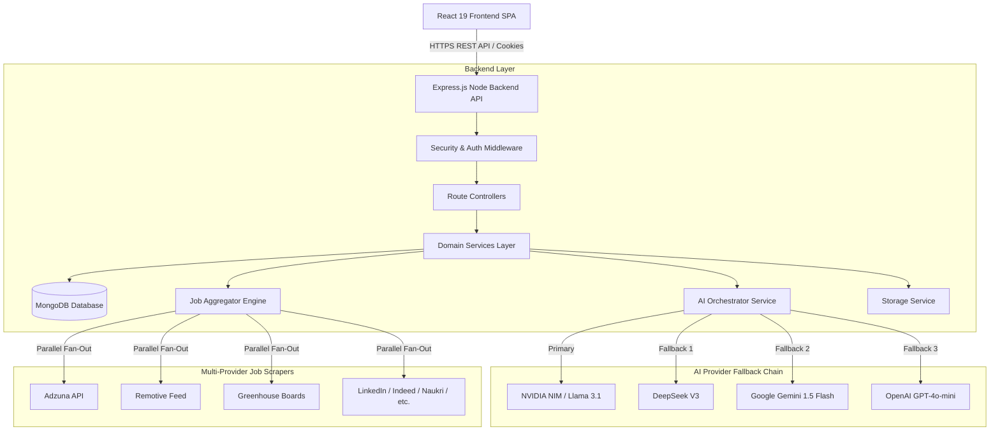

# ApplyHub — AI-Powered Job Aggregator, ATS Resume Analyzer & Application Tracker


[](https://github.com/Sanesh764/APPLYHUB)
[](LICENSE)
[](https://nodejs.org)
[](https://react.dev)
[](https://vitejs.dev)
[](https://www.mongodb.com)

ApplyHub is a production-grade, AI-powered, multi-provider job search engine, ATS resume compatibility analyzer, and candidate application tracker built with **React 19**, **Node.js**, **Express 5**, **MongoDB**, and **Multi-LLM AI Orchestration** (NVIDIA Llama 3.1, DeepSeek V3, Google Gemini 1.5 Flash, and OpenAI GPT-4o-mini).

---

## 🔗 Live Application & Demo Links

- **Live Frontend Web App**: [https://main.ddzv29gajckkr.amplifyapp.com](https://main.ddzv29gajckkr.amplifyapp.com)
- **Production API Endpoint**: `https://api.applyhub.com/api/v1` (or local `http://localhost:8080/api/v1`)
- **API Health Check**: `/health`

---

## ✨ Core Key Features

- **🌐 Multi-Provider Real-Time Job Aggregation**: Aggregates job postings in parallel across 15+ job scrapers (**Adzuna**, **Remotive**, **Arbeitnow**, **Greenhouse**, **Lever**, **SmartRecruiters**, **Ashby**, **Recruitee**, **LinkedIn**, **Indeed**, **Naukri**, **Foundit**, **Cutshort**, **Instahyre**, **Wellfound**, and **YC Jobs**).
- **🌍 Country-Agnostic Engine (India-First Default)**: Dynamically scopes location rules, currency formats, and candidate timezone eligibility (defaults to India, easily switchable to US, UK, etc.).
- **🤖 Multi-LLM AI Orchestration & Resilient Fallback**: Dispatches AI tasks through an intelligent priority chain: **NVIDIA NIM (Llama 3.1)** $\rightarrow$ **DeepSeek V3** $\rightarrow$ **Google Gemini 1.5 Flash** $\rightarrow$ **OpenAI GPT-4o-mini** $\rightarrow$ **Mock Fallback**. Validates all LLM JSON outputs using **Zod**.
- **🎯 Smart Weighted Ranking Algorithm**: Ranks search results using a 6-signal formula:
  - `40%` Resume Keyword Overlap Score
  - `20%` Target Country Location Priority Tier
  - `15%` Posting Freshness
  - `10%` Salary Level
  - `10%` Search Term Match
  - `5%` Company Brand Quality
- **🧹 Jaccard Cross-Posting Deduplication**: Uses text Jaccard similarity (>75% description overlap) and canonical URL matching to eliminate duplicate job listings across boards.
- **📄 ATS Resume Parsing & Compatibility Scoring**: Parses PDF and Word DOCX resumes (`pdf-parse` & `mammoth`), extracting technical skills, work experience, projects, and education while returning detailed ATS compatibility feedback (0–100 score).
- **📄 Dedicated Job Details View (`/jobs/:jobId`)**: Comprehensive page showing job description, company metadata, internship statistics (stipend, duration, PPO status), and an **AI Career Assistant** providing interview readiness ratings, difficulty levels, expected technical questions, preparation roadmaps, and clickable learning resources.
- **📋 Kanban Application Tracker**: Tracks job applications across 6 status columns (`saved`, `applied`, `pending`, `interview`, `offer`, `rejected`).
- **✍️ AI Cover Letter Generator**: Generates custom, ready-to-use cover letters tailored to specific job postings and the candidate's active resume.
- **🔒 Dual Authentication & Security**: Email/password & 6-digit phone SMS OTP authentication, bcrypt hashing, JWT access/refresh tokens in HTTP-only cookies, session device management, Helmet headers, and Express rate limiting.

---

## 🛠 Tech Stack

### Frontend Architecture
- **Framework**: React 19 SPA
- **Build Tool**: Vite 8
- **Styling**: TailwindCSS 4, Custom Glassmorphism UI
- **State & Query Management**: TanStack React Query v5, Context API
- **Icons & Charts**: Lucide React, Recharts

### Backend Architecture
- **Runtime**: Node.js v20.x, Express.js 5
- **Database**: MongoDB, Mongoose 9
- **AI Framework**: NVIDIA NIM SDK, OpenAI SDK, `@google/generative-ai`, Zod
- **Document Parsers**: `pdf-parse`, `mammoth`
- **File Storage**: Dual-Mode (Cloudinary Cloud API with local disk fallback)
- **Email & Alerts**: Nodemailer (SMTP), Winston Logger
- **Security & Auth**: JWT, bcryptjs, Helmet, CORS, Express-Rate-Limit, Express-Useragent

---

## 🏛 System Architecture Overview



---

## 📂 Project Structure

```
ApplyHub/
├── README.md                  # Main entry point documentation
├── docs/                      # Comprehensive technical documentation suite
│   ├── Architecture.md        # System architecture & data flow
│   ├── Installation.md        # Local setup & troubleshooting
│   ├── Environment.md         # Environment variables reference
│   ├── Folder-Structure.md    # Codebase directory layout
│   ├── Backend.md             # Node.js Express backend documentation
│   ├── Frontend.md            # React 19 SPA documentation
│   ├── API.md                 # REST API reference guide
│   ├── Authentication.md      # JWT, OTP, & bcrypt authentication
│   ├── Authorization.md       # Role-based access control (RBAC)
│   ├── Database.md            # MongoDB schemas, ERD, & indexing
│   ├── Models.md              # Field-level database model documentation
│   ├── Middlewares.md         # Express middleware functions
│   ├── Controllers.md         # Route controllers documentation
│   ├── Services.md            # Domain business logic services
│   ├── AI-System.md           # Multi-LLM provider & Zod validation
│   ├── Job-System.md          # 15+ Job scrapers & weighted ranking
│   ├── Resume-System.md       # Document text parsing & ATS analysis
│   ├── Deployment.md          # Production deployment guide
│   ├── Security.md            # Security policies & rate limiting
│   ├── Error-Handling.md      # Custom ApiError hierarchy
│   ├── Performance.md         # Latency reduction & caching
│   ├── Contributing.md       # Developer setup & PR checklist
│   └── FAQ.md                 # Frequently asked questions
├── backend/                   # Node.js + Express backend project
└── frontend/                  # React 19 + Vite frontend project
```

---

## 🚀 Quick Start — Running Locally

### Prerequisites
- Node.js `v18+` (Recommended: `v20.x`)
- MongoDB (Running locally on `mongodb://localhost:27017` or MongoDB Atlas URL)

### 1. Clone & Setup Backend
```bash
git clone https://github.com/Sanesh764/APPLYHUB.git
cd ApplyHub/backend
npm install
cp .env.Example .env
# Edit .env with your MONGODB_URI and optional GEMINI_API_KEY
npm run dev
```
*Backend listens at `http://localhost:8080`.*

### 2. Setup Frontend
```bash
cd ../frontend
npm install
npm run dev
```
*Frontend runs at `http://localhost:5173`.*

---

## 📖 Documentation Suite

For detailed technical explanations, click any link below:

- 🏛 **[Architecture Overview](docs/Architecture.md)** — High-level system topology, data flows, and design patterns.
- ⚡ **[Installation Guide](docs/Installation.md)** — Step-by-step local setup and troubleshooting.
- 🔑 **[Environment Variables](docs/Environment.md)** — Exhaustive list of backend `.env` variables.
- 📁 **[Folder Structure](docs/Folder-Structure.md)** — Detailed directory breakdown.
- ⚙️ **[Backend Guide](docs/Backend.md)** — Express app architecture and middleware execution pipelines.
- 🎨 **[Frontend Guide](docs/Frontend.md)** — React 19 layout wrappers, state management, and page views.
- 📡 **[REST API Reference](docs/API.md)** — Complete endpoint routes, parameters, and responses.
- 🔐 **[Authentication Subsystem](docs/Authentication.md)** — Dual-channel auth, JWT strategy, and session tracking.
- 🛡 **[Role Authorization](docs/Authorization.md)** — Role-based access control (`user` vs `admin`).
- 🗄 **[Database Schemas](docs/Database.md)** — MongoDB ERD, compound indexing, and full-text search.
- 📑 **[Data Models](docs/Models.md)** — Field-level documentation for all 10 Mongoose models.
- 🤖 **[AI Subsystem](docs/AI-System.md)** — Multi-LLM provider chain, Zod validation, and mock fallbacks.
- 💼 **[Job Search Engine](docs/Job-System.md)** — 15+ job scrapers, Jaccard deduplication, and smart ranking.
- 📄 **[Resume Parsing & ATS](docs/Resume-System.md)** — PDF/DOCX text extraction and ATS analysis.
- 🚀 **[Deployment Guide](docs/Deployment.md)** — Deploying to AWS Amplify, Render, and MongoDB Atlas.
- 🔒 **[Security Documentation](docs/Security.md)** — Helmet, CORS, rate limiting, and security audit logs.
- ⚡ **[Performance Tuning](docs/Performance.md)** — Parallel fan-out, NodeCache TTL, and lazy AI enrichment.

---

## 🔮 Future Improvements

- [ ] Add WebSocket (`socket.io`) push notifications for real-time application status changes.
- [ ] Add direct integration with Internshala for expanded student internship feeds.
- [ ] Implement Chrome Extension for 1-click job bookmarking from external websites.

---

## 📄 License & Author

- **Author**: Sanesh Kumar ([@Sanesh764](https://github.com/Sanesh764))
- **License**: ISC License
