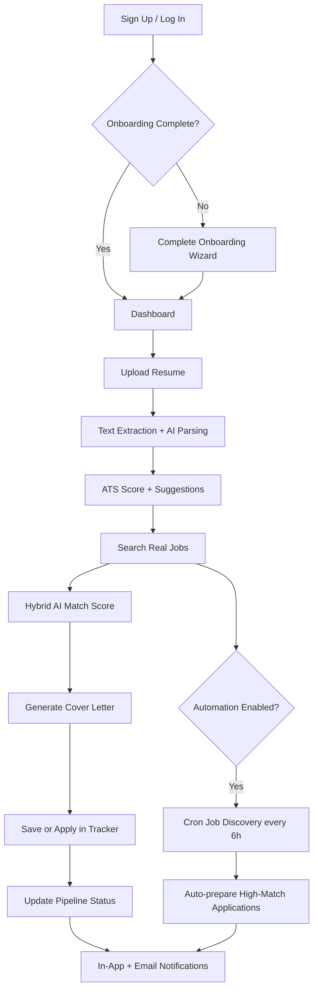
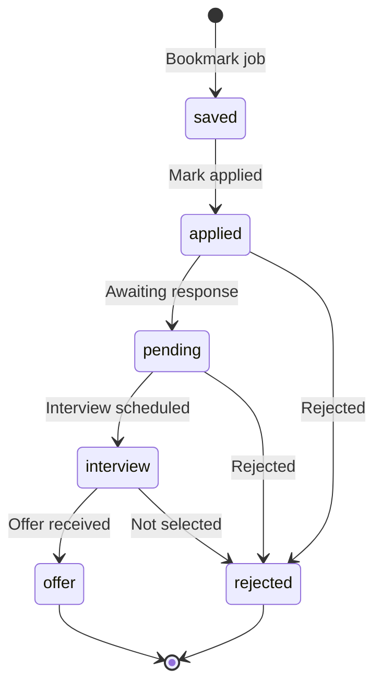
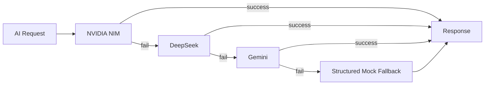
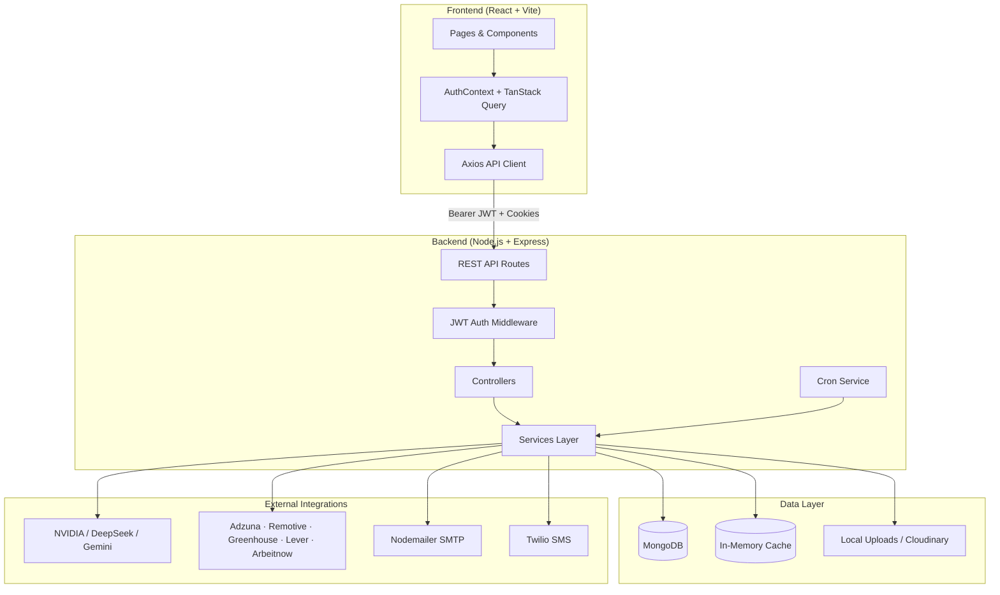
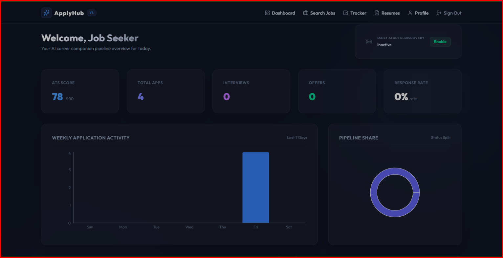
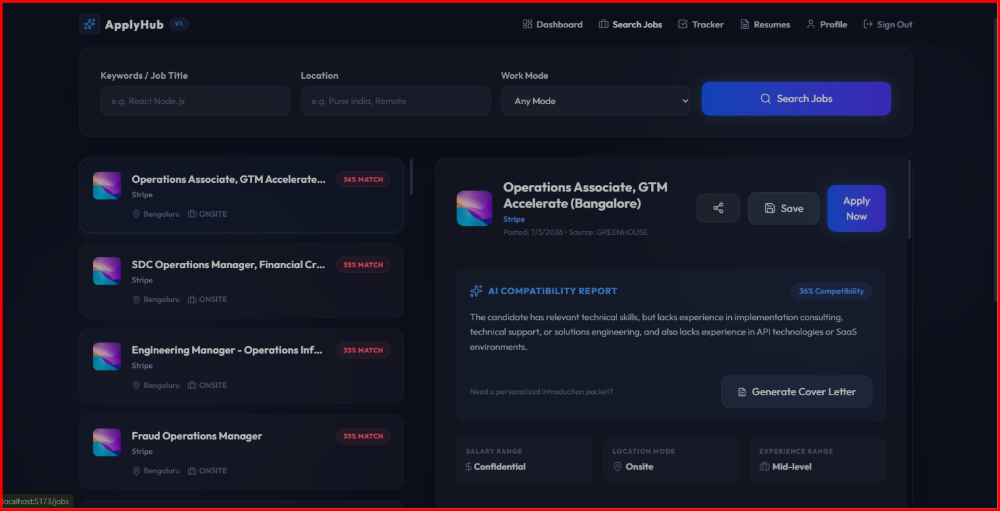
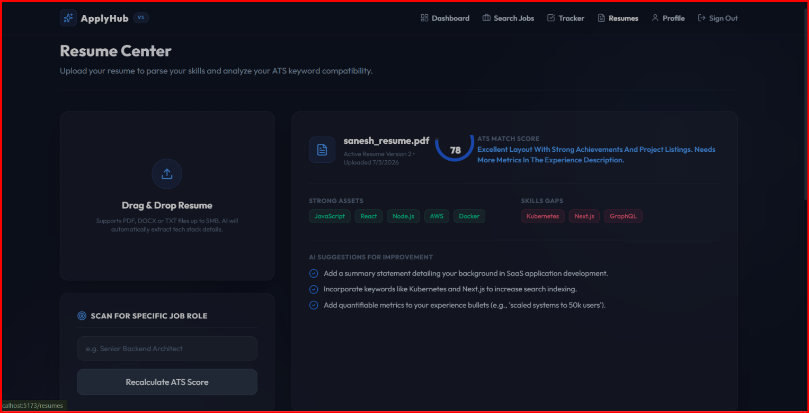
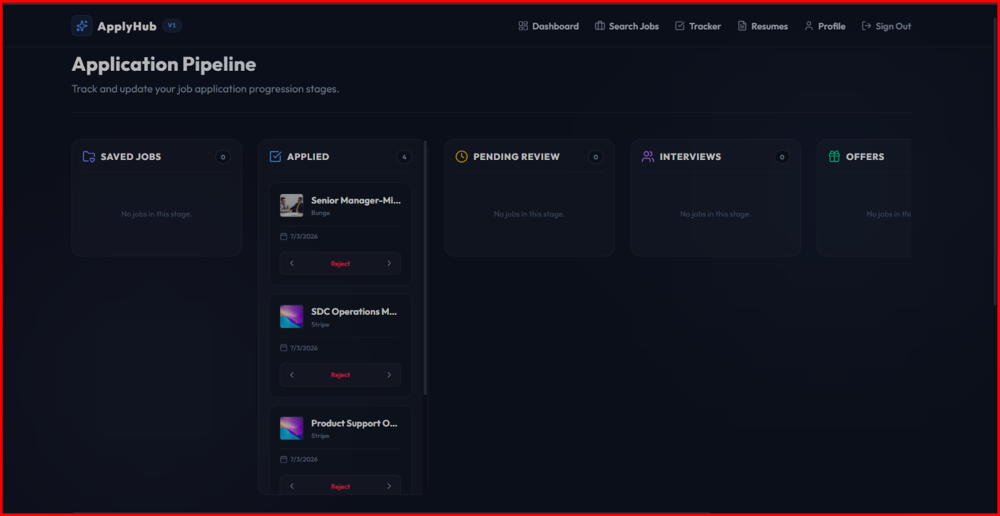
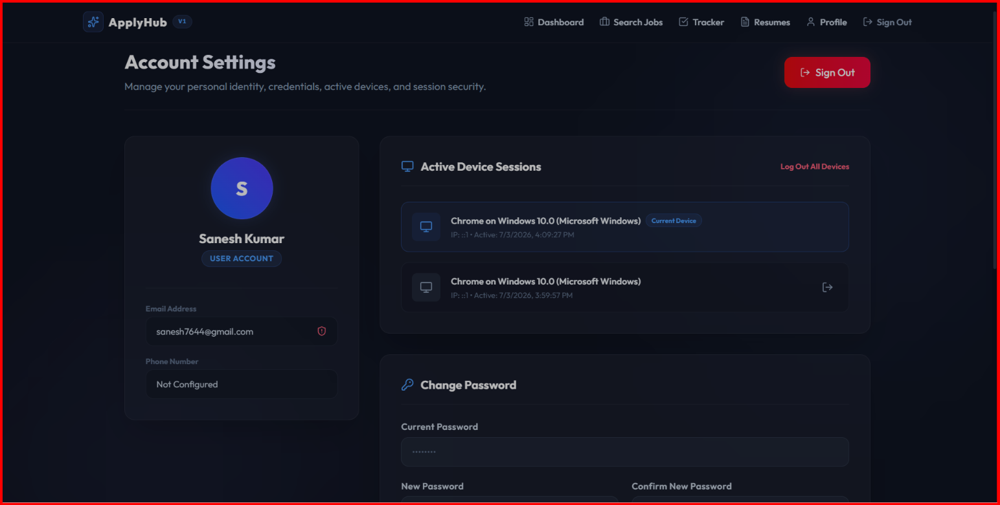
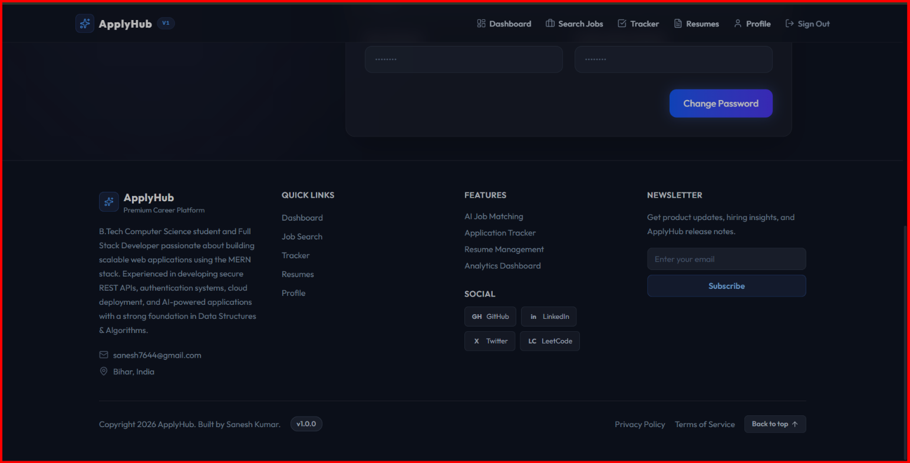

<div align="center">

# ApplyHub

**AI-powered job search, resume intelligence, and application tracking — built for modern job seekers.**

[](https://react.dev/)
[](https://nodejs.org/)
[](https://www.mongodb.com/)
[](https://tailwindcss.com/)
[](./backend/package.json)

[Live Demo](https://main.ddzv29gajckkr.amplifyapp.com) · [Report Bug](https://github.com/Sanesh764/APPLYHUB/issues) · [Request Feature](https://github.com/Sanesh764/APPLYHUB/issues)

</div>

---

## Table of Contents

- [About the Developer](#about-the-developer)
- [Project Introduction](#project-introduction)
- [Why Use ApplyHub?](#why-use-applyhub)
- [Project Features](#project-features)
- [How It Works](#how-it-works)
- [Project Architecture](#project-architecture)
- [Tech Stack](#tech-stack)
- [Installation Guide](#installation-guide)
- [API Documentation](#api-documentation)
- [Screenshots](#screenshots)
- [Project Highlights](#project-highlights)
- [Future Roadmap](#future-roadmap)
- [Contribution Guide](#contribution-guide)
- [Contact](#contact)
- [Support](#support)

---

## About the Developer

<table>
<tr>
<td width="120">

</td>
<td>

### Sanesh Kumar
**Full Stack Developer | MERN Stack Developer**  
📍 Bihar, India

B.Tech Computer Science student passionate about building scalable web applications with the MERN stack — secure REST APIs, authentication systems, cloud deployment, and AI-powered products.

</td>
</tr>
</table>

<p align="center">
  <a href="mailto:sanesh7644@gmail.com">
    
  </a>
  <a href="https://github.com/Sanesh764">
    
  </a>
  <a href="https://www.linkedin.com/in/sanesh-kumar-1802b1293/">
    
  </a>
  <a href="https://leetcode.com/u/sanesh7644/">
    
  </a>
  <a href="https://x.com/Sanesh847">
    
  </a>
  <a href="https://main.d3add5rrxtdy8u.amplifyapp.com/">
    
  </a>
</p>

---

## Project Introduction

### What is ApplyHub?

ApplyHub is a full-stack SaaS career platform that helps job seekers manage their entire hiring workflow in one place — from resume upload and ATS scoring to real job discovery, AI matching, cover letter generation, and application tracking.

It is not a traditional job board. Instead, it acts as an **intelligent career co-pilot** that connects your resume to live opportunities, scores fit, prepares application materials, and tracks outcomes over time.

### What problem does it solve?

Job searching is fragmented. Candidates typically:

- Upload resumes repeatedly across portals
- Guess whether their resume passes ATS filters
- Manually track dozens of applications in spreadsheets
- Write unique cover letters for every role
- Miss strong matches because listings are spread across multiple providers

ApplyHub centralizes these workflows and adds AI-assisted decision-making on top of real job data.

### Why was it built?

ApplyHub was built to demonstrate production-grade MERN engineering combined with practical AI integration — secure authentication, resume parsing, multi-provider job aggregation, hybrid matching algorithms, automated discovery, and a polished recruiter-ready UI.

### Who should use it?

| Audience | Use Case |
|---|---|
| **Job seekers & students** | Upload resumes, improve ATS scores, search jobs, track applications |
| **Recruiters & hiring managers** | Evaluate a candidate's full-stack and product thinking through a real SaaS build |
| **Developers** | Study a modular MERN architecture with JWT auth, AI provider fallback, and job API aggregation |
| **Open-source contributors** | Extend providers, improve matching, add integrations, or harden security |

### What makes it different from traditional job portals?

| Traditional Portals | ApplyHub |
|---|---|
| List jobs only | Parses resume + scores ATS compatibility |
| No personalization | Hybrid AI + keyword job matching (60/40 weighting) |
| Manual cover letters | AI-generated, job-specific cover letters |
| External tracking tools | Built-in Kanban application pipeline |
| Single job source | Aggregates Adzuna, Remotive, Greenhouse, Lever, and Arbeitnow |
| Passive browsing | Optional automated job discovery every 6 hours |
| Generic accounts | Session management, audit logs, role-based admin panel |

---

## Why Use ApplyHub?

| Capability | What You Get |
|---|---|
| **AI Resume Analysis** | Upload PDF/DOC/DOCX/TXT — AI extracts skills, experience, education, and projects |
| **ATS Score** | Role-based ATS scoring with strong skills, gaps, and quality rating |
| **AI Resume Suggestions** | Actionable `improvementSuggestions`, formatting tips, and keyword analysis |
| **Multi-Provider Job Search** | Parallel search across 5 job providers with India-focused filtering |
| **Smart Job Matching** | Hybrid match score: 60% semantic AI + 40% keyword overlap |
| **Cover Letter Generator** | Personalized cover letters from resume + job description |
| **Resume Version Management** | Versioned uploads, active resume switching, Cloudinary or local storage |
| **Application Tracker** | Kanban pipeline: Saved → Applied → Pending → Interview → Offer → Rejected |
| **Automated Job Discovery** | Cron-based scanning for users who enable automation (≥80% match threshold) |
| **Email Notifications** | Application confirmations, status updates, and daily digests via SMTP |
| **Secure Authentication** | JWT access tokens, HttpOnly refresh cookies, sessions, rate limiting, audit logs |

> **Note:** ApplyHub records applications and prepares materials inside the platform. For external listings, users are redirected to the official `applyUrl` to complete submission on the employer's site.

---

## Project Features

### Authentication

- Email/password signup with email verification link
- Phone signup and login via OTP (Twilio SMS)
- JWT access token + HttpOnly refresh token cookie
- Silent token refresh with Axios interceptor queue
- Forgot password and reset password flows
- Change password with full session revocation
- Multi-device session listing, per-device revoke, and logout-all
- Account lockout after repeated failed login attempts
- Role-based access: `user` and `admin`
- Two-factor fields exist in the user model (UI flow marked as coming soon)

### Resume Management

- Drag-and-drop resume upload (max 5 MB)
- Supported formats: PDF, DOC, DOCX, TXT
- Text extraction via `pdf-parse` and `mammoth`
- AI structured parsing (skills, experience, education, projects)
- Automatic versioning with active resume selection
- Delete versions with automatic promotion of latest remaining version
- Re-run ATS analysis for a custom target role
- Profile skills auto-seeded from parsed resume when empty

### AI Features

- Multi-provider orchestration with automatic fallback: **NVIDIA → DeepSeek → Gemini**
- Resume parsing into structured JSON
- ATS analysis with score, gaps, strengths, and suggestions
- Hybrid job-resume matching with explanation, advantages, disadvantages
- AI cover letter generation
- Per job-resume AI analysis cache in MongoDB (`AIAnalysis` model)
- Job detail view compiles match score, ATS compatibility, cover letter, and success probabilities
- Provider health checks and diagnostic test endpoint

### Job Search

- Protected job search API with filters: keywords, location, work mode, salary
- Aggregated providers: **Remotive**, **Arbeitnow**, **Greenhouse**, **Lever**, **Adzuna** (when API keys configured)
- India-focused location filtering and foreign relocation exclusion
- In-memory search result caching (10-minute TTL)
- Jobs upserted to MongoDB for stable IDs and application linking
- Match percentage sorting or posted-date sorting
- Save jobs, mark as applied, generate cover letter, share job details
- Opens official application URL in a new tab on apply
- Dev utility: `POST /jobs/seed` for mock local job data

### Automation

- `node-cron` scheduled job discovery every **6 hours**
- Runs for users with completed onboarding + `isAutomationEnabled: true`
- Matches jobs against profile preferences (role, work mode, salary, city)
- ≥80% match: prepares application package with AI cover letter
- Creates in-app notifications and sends email digest summaries
- Dashboard toggle to enable/disable automation

### Dashboard

- ATS score, total applications, interviews, offers, response rate
- Weekly application activity bar chart (Recharts)
- Pipeline status pie chart
- Top recommended job matches
- In-app notification feed with mark-all-read
- Automation status control panel

### Security

- Helmet security headers
- CORS with credential support
- Global API rate limiting (100 req / 15 min)
- Auth rate limiting (15 attempts / 15 min)
- OTP rate limiting (5 req / hour per IP+phone)
- Zod request validation on profile and auth routes
- bcrypt password hashing (12 salt rounds)
- Winston structured logging
- Audit log trail for auth, resume, and application events
- Admin audit log viewer with search and pagination

### Performance

- Response compression (gzip)
- In-memory job search cache
- MongoDB-cached AI analysis per user/resume version/job
- Parallel provider job fetching with deduplication
- Parallel AI scoring in job detail analysis

### Admin Features

- Admin-only route guard in frontend (`AdminRoute`)
- View all registered users with search
- View system audit logs (filterable, paginated)
- Admin dashboard stats: total users, admin count, recent security events

---

## How It Works

### User Journey



### Application Pipeline



### AI Provider Fallback



### Step-by-Step Workflow

1. **Sign up / Log in** — Email + password or phone OTP
2. **Verify email** — Required for email-based accounts before full access
3. **Onboarding** — Set preferred role, experience, skills, locations, work mode, salary
4. **Upload resume** — File parsed and scored automatically
5. **Resume parsing** — Extract text → AI structures profile data
6. **AI analysis** — ATS score, missing skills, improvement suggestions
7. **Search real jobs** — Multi-provider aggregation with filters
8. **AI match score** — Hybrid scoring on every result (when resume exists)
9. **Generate cover letter** — On demand from Job Search page
10. **Apply** — Record in tracker, send confirmation email, open external apply link
11. **Track application** — Move cards across Kanban columns
12. **Receive notifications** — Dashboard alerts + SMTP emails on status changes

---

## Project Architecture



### Layer Breakdown

| Layer | Responsibility |
|---|---|
| **Frontend** | React 19 SPA with protected routes, dashboard, job search, resume center, tracker, profile, admin panel |
| **Backend** | Express 5 REST API with controllers, services, middleware, and cron jobs |
| **Database** | MongoDB via Mongoose — Users, Sessions, Profiles, Resumes, Jobs, Applications, Notifications, AIAnalysis, AuditLogs, OTP |
| **AI Providers** | Pluggable provider classes with shared base interface and orchestrated fallback |
| **Cloudinary** | Optional cloud resume storage (falls back to local `public/uploads`) |
| **SMTP** | Nodemailer for verification, password reset, application updates, and digests |
| **Authentication** | JWT access tokens (15m default) + refresh tokens (7d) stored as hashed sessions |
| **Job Providers** | Parallel fetch, dedupe, India filter, client-side refinement |

### Repository Structure

```
ApplyHub/
├── backend/
│   ├── app.js                 # Express app & route mounting
│   ├── server.js              # Server bootstrap + cron init
│   ├── config/                  # DB, logger
│   ├── controllers/             # Route handlers
│   ├── middleware/              # Auth, rate limits, validation, errors
│   ├── models/                  # Mongoose schemas
│   ├── routes/                  # API route definitions
│   ├── services/                # Business logic & integrations
│   │   └── ai/providers/        # NVIDIA, DeepSeek, Gemini, OpenAI
│   └── scratch/                 # Seed & diagnostic scripts
└── frontend/
    ├── src/
    │   ├── components/          # UI, layout, route guards
    │   ├── contexts/            # AuthContext
    │   ├── hooks/               # useAuth
    │   ├── pages/               # Dashboard, Jobs, Resumes, Tracker, etc.
    │   ├── services/            # Axios API client
    │   └── constants/           # Portfolio & footer data
    └── vite.config.js
```

---

## Tech Stack

### Frontend


### Backend


### AI & Integrations


### Job Data Providers


---

## Installation Guide

### Prerequisites

- **Node.js** 18+ recommended
- **MongoDB** (local or MongoDB Atlas)
- **npm** or compatible package manager
- API keys for AI providers, SMTP, and optional services (see Environment Variables)

### 1. Clone the repository

```bash
git clone https://github.com/Sanesh764/APPLYHUB.git
cd APPLYHUB
```

### 2. Install dependencies

**Backend:**

```bash
cd backend
npm install
```

**Frontend:**

```bash
cd ../frontend
npm install
```

### 3. Configure environment variables

Create `backend/.env`:

```env
# Server
PORT=8080
NODE_ENV=development
FRONTEND_URL=http://localhost:5173
BACKEND_URL=http://localhost:8080

# Database
MONGODB_URI=mongodb://127.0.0.1:27017/applyhub

# JWT
JWT_ACCESS_SECRET=your_access_secret
JWT_REFRESH_SECRET=your_refresh_secret
JWT_ACCESS_EXPIRY=15m
JWT_REFRESH_EXPIRY=7d

# AI Providers (configure at least one)
NVIDIA_API_KEY=
NVIDIA_MODEL=meta/llama-3.1-8b-instruct
DEEPSEEK_API_KEY=
GEMINI_API_KEY=
OPENAI_API_KEY=

# Job Search (Adzuna India — optional but recommended)
ADZUNA_APP_ID=
ADZUNA_APP_KEY=

# Email (SMTP)
SMTP_HOST=
SMTP_PORT=587
SMTP_USER=
SMTP_PASS=
SMTP_FROM=noreply@applyhub.com

# SMS OTP (optional — required for phone auth)
TWILIO_ACCOUNT_SID=
TWILIO_AUTH_TOKEN=
TWILIO_FROM_NUMBER=

# Cloudinary (optional — uses local storage if omitted)
CLOUDINARY_CLOUD_NAME=
CLOUDINARY_API_KEY=
CLOUDINARY_API_SECRET=

# Logging
LOG_LEVEL=info
```

Create `frontend/.env`:

```env
VITE_API_URL=http://localhost:8080/api/v1
```

### 4. Seed database (optional)

Create default admin and test user accounts:

```bash
cd backend
node scratch/seed.js
```

| Account | Email | Password | Role |
|---|---|---|---|
| Admin | `admin@applyhub.com` | `Password123!` | admin |
| User | `user@applyhub.com` | `Password123!` | user |

### 5. Run development servers

**Terminal 1 — Backend:**

```bash
cd backend
npm run dev
```

**Terminal 2 — Frontend:**

```bash
cd frontend
npm run dev
```

| Service | URL |
|---|---|
| Frontend | http://localhost:5173 |
| Backend API | http://localhost:8080/api/v1 |
| Health Check | http://localhost:8080/health |

### 6. Run production build

**Frontend:**

```bash
cd frontend
npm run build
npm run preview
```

**Backend:**

```bash
cd backend
NODE_ENV=production node server.js
```

> Serve the frontend `dist/` folder via Vercel, Netlify, or AWS Amplify. Deploy the backend to Render, Railway, AWS EC2, or similar. Set `FRONTEND_URL`, `MONGODB_URI`, and all production secrets in your hosting environment.

---

## API Documentation

**Base URL:** `http://localhost:8080/api/v1`

**Auth:** Protected routes require `Authorization: Bearer <access_token>`

**Response format:**

```json
{
  "success": true,
  "message": "Human-readable message",
  "data": {}
}
```

---

### Auth — `/auth`

| Method | Endpoint | Auth | Description |
|---|---|---|---|
| `POST` | `/signup/email` | Public | Register with name, email, password |
| `POST` | `/signup/phone` | Public | Register with name, email, phone (sends OTP) |
| `POST` | `/login/email` | Public | Login with email and password |
| `POST` | `/otp/send` | Public | Send OTP to phone number |
| `POST` | `/otp/verify` | Public | Verify OTP and complete login/signup |
| `POST` | `/verify-email` | Public | Verify email via `email` + `token` query params |
| `POST` | `/forgot-password` | Public | Request password reset email |
| `POST` | `/reset-password` | Public | Reset password with email, token, newPassword |
| `POST` | `/refresh-token` | Public | Refresh access token (HttpOnly cookie) |
| `POST` | `/logout` | Public | Logout current session |
| `GET` | `/me` | Protected | Get current authenticated user |
| `POST` | `/change-password` | Protected | Change password (revokes all sessions) |
| `POST` | `/logout-all` | Protected | Logout from all devices |
| `GET` | `/sessions` | Protected | List active device sessions |
| `DELETE` | `/sessions/:sessionId` | Protected | Revoke a specific session |
| `GET` | `/admin/users` | Admin | List all registered users |
| `GET` | `/admin/audit-logs` | Admin | Paginated audit logs (`page`, `limit`, `event`, `status`) |

<details>
<summary><strong>Auth request examples</strong></summary>

**POST `/auth/signup/email`**

```json
{
  "name": "Sanesh Kumar",
  "email": "sanesh7644@gmail.com",
  "password": "SecurePass123!"
}
```

**POST `/auth/login/email`**

```json
{
  "email": "sanesh7644@gmail.com",
  "password": "SecurePass123!"
}
```

**POST `/auth/otp/verify`**

```json
{
  "phone": "+919876543210",
  "code": "123456"
}
```

</details>

---

### Profile — `/profile`

| Method | Endpoint | Auth | Description |
|---|---|---|---|
| `GET` | `/` | Protected | Get onboarding profile |
| `POST` | `/` | Protected | Create or update profile (marks onboarding complete) |

<details>
<summary><strong>Profile request body</strong></summary>

```json
{
  "preferredRole": "Full Stack Developer",
  "experienceLevel": "mid",
  "skills": ["React", "Node.js", "MongoDB"],
  "preferredCountries": ["India"],
  "preferredCities": ["Bengaluru"],
  "workMode": "remote",
  "expectedSalary": 800000,
  "employmentType": "full-time",
  "noticePeriod": 30,
  "workAuthorization": "Indian Citizen",
  "languages": ["English", "Hindi"],
  "isAutomationEnabled": false
}
```

</details>

---

### Resumes — `/resumes`

| Method | Endpoint | Auth | Description |
|---|---|---|---|
| `POST` | `/` | Protected | Upload resume (`multipart/form-data`, field: `resume`) |
| `GET` | `/` | Protected | List all resume versions |
| `DELETE` | `/:resumeId` | Protected | Delete a resume version |
| `POST` | `/:resumeId/active` | Protected | Set resume as active |
| `POST` | `/:resumeId/analyze` | Protected | Re-run ATS analysis for a target role |

<details>
<summary><strong>ATS re-analysis body</strong></summary>

```json
{
  "targetRole": "Senior Backend Engineer"
}
```

</details>

---

### Jobs — `/jobs`

| Method | Endpoint | Auth | Description |
|---|---|---|---|
| `GET` | `/providers/health` | Protected | Adzuna provider health check |
| `GET` | `/` | Protected | Search jobs with query filters |
| `POST` | `/seed` | Protected | Seed mock local jobs (development) |
| `GET` | `/:jobId` | Protected | Job details + cached AI analysis |

<details>
<summary><strong>Job search query parameters</strong></summary>

| Param | Description |
|---|---|
| `query` | Keywords / job title |
| `location` | Location filter |
| `workMode` | `remote`, `hybrid`, `onsite` |
| `salary` | Minimum salary |
| `experienceLevel` | Experience filter |
| `country`, `state`, `city` | Geographic filters |
| `company` | Company name filter |
| `jobType` | Employment type filter |
| `sortBy` | `match` (default) or `date` |

</details>

---

### Applications — `/applications`

| Method | Endpoint | Auth | Description |
|---|---|---|---|
| `GET` | `/` | Protected | List all user applications |
| `POST` | `/` | Protected | Create application (save or apply) |
| `PUT` | `/:applicationId/status` | Protected | Update pipeline status |
| `POST` | `/cover-letter` | Protected | Generate AI cover letter for a job |
| `GET` | `/analytics` | Protected | Dashboard analytics data |

<details>
<summary><strong>Application request examples</strong></summary>

**POST `/applications`**

```json
{
  "jobId": "665f1a2b3c4d5e6f7a8b9c0d",
  "status": "saved",
  "coverLetter": "Optional pre-written letter"
}
```

Allowed statuses: `saved`, `applied`, `pending`, `interview`, `rejected`, `offer`

**PUT `/applications/:applicationId/status`**

```json
{
  "status": "interview",
  "notes": "Phone screen scheduled for next week"
}
```

**POST `/applications/cover-letter`**

```json
{
  "jobId": "665f1a2b3c4d5e6f7a8b9c0d"
}
```

</details>

---

### Notifications — `/notifications`

| Method | Endpoint | Auth | Description |
|---|---|---|---|
| `GET` | `/` | Protected | Get user notifications |
| `POST` | `/read` | Protected | Mark all notifications as read |

---

### AI — `/ai`

| Method | Endpoint | Auth | Description |
|---|---|---|---|
| `GET` | `/health` | Public | AI provider health status |
| `POST` | `/test` | Public | Send test prompt to active AI provider |

---

### System — `/system`

| Method | Endpoint | Auth | Description |
|---|---|---|---|
| `GET` | `/health` | Public | Full system diagnostic (DB, AI, jobs, SMTP, Cloudinary) |

---

### Utility Endpoints

| Method | Endpoint | Auth | Description |
|---|---|---|---|
| `GET` | `/health` | Public | Basic server uptime check |
| `POST` | `/api/v1/test/email` | Public | Send SMTP test email (`{ "email": "..." }`) |

---

## Screenshots

> Add screenshots to `docs/screenshots/` and they will render below.

### Dashboard



### Job Search



### Resume Upload



### ATS Analysis


### Application Tracker



### Profile & Sessions



### Admin Dashboard



---

## Project Highlights

- ✔ **AI Powered** — Multi-provider orchestration with NVIDIA, DeepSeek, and Gemini
- ✔ **Real Job Search** — Live listings from 5 aggregated providers
- ✔ **ATS Optimization** — Role-based scoring with actionable improvement suggestions
- ✔ **Resume Parser** — PDF, DOC, DOCX, and TXT extraction + structured AI parsing
- ✔ **Resume Versioning** — Full version history with active resume management
- ✔ **Smart Matching** — 60/40 hybrid AI + keyword scoring
- ✔ **Cover Letter Generator** — Job-specific AI cover letters with print support
- ✔ **Secure Authentication** — JWT, refresh cookies, sessions, rate limits, audit trail
- ✔ **Responsive UI** — Dark-themed SaaS interface built with Tailwind CSS
- ✔ **Cloud Storage** — Cloudinary integration with local fallback

---

## Future Roadmap

| Phase | Planned Enhancement |
|---|---|
| **Q3 2026** | Complete two-factor authentication UI and TOTP setup flow |
| **Q3 2026** | Interview question generator exposed via API and job detail UI |
| **Q4 2026** | LinkedIn / Naukri / Indeed provider integrations |
| **Q4 2026** | Resume PDF export with AI-applied suggestions |
| **Q1 2027** | Browser extension for one-click job saving |
| **Q1 2027** | Team/recruiter workspace with shared pipelines |
| **Q2 2027** | Mobile-responsive PWA with push notifications |
| **Ongoing** | Expanded admin analytics, GDPR tooling, and privacy/terms pages |

---

## Contribution Guide

Contributions are welcome. Whether you are fixing a bug, improving documentation, or adding a new job provider — your help makes ApplyHub better.

### Getting Started

1. **Fork** the repository
2. **Clone** your fork locally
3. Create a feature branch: `git checkout -b feature/your-feature-name`
4. Install dependencies for both `frontend/` and `backend/`
5. Configure `.env` files (see [Installation Guide](#installation-guide))
6. Make your changes with clear, focused commits
7. Run `npm run build` in `frontend/` to verify the build passes
8. Push and open a **Pull Request** against `main`

### Contribution Guidelines

- Follow existing code style and naming conventions
- Keep PRs focused — one feature or fix per PR
- Document new API endpoints in this README
- Do not commit `.env` files or API keys
- Add meaningful commit messages (e.g., `feat: add Indeed job provider adapter`)

### Areas That Need Help

- Additional job board provider adapters
- AI prompt tuning for ATS and matching accuracy
- Unit and integration tests
- Accessibility improvements
- Performance profiling for large job result sets

---

## Contact

<div align="center">

### Sanesh Kumar
**Full Stack Developer | MERN Stack Developer**

📍 Bihar, India

<p>
  <a href="mailto:sanesh7644@gmail.com">
    
  </a>
  <br/><br/>
  <a href="https://github.com/Sanesh764">
    
  </a>
  <a href="https://www.linkedin.com/in/sanesh-kumar-1802b1293/">
    
  </a>
  <a href="https://leetcode.com/u/sanesh7644/">
    
  </a>
  <a href="https://x.com/Sanesh847">
    
  </a>
  <a href="https://github.com/Sanesh764">
    
  </a>
</p>

*Open to internship and full-time opportunities.*

</div>

---

## Support

If ApplyHub helped you or impressed a recruiter, consider supporting the project:

| Action | How |
|---|---|
| ⭐ **Star the repository** | [github.com/Sanesh764/APPLYHUB](https://github.com/Sanesh764/APPLYHUB) |
| 🍴 **Fork the project** | Build your own features on top of ApplyHub |
| 🐞 **Report issues** | [Open an issue](https://github.com/Sanesh764/APPLYHUB/issues) with steps to reproduce |
| 💡 **Suggest features** | [Request a feature](https://github.com/Sanesh764/APPLYHUB/issues/new) |
| 🤝 **Contribute** | Submit a pull request — see [Contribution Guide](#contribution-guide) |

---

<div align="center">

**Built with care by [Sanesh Kumar](https://github.com/Sanesh764)**

*ApplyHub — Your AI career companion.*

</div>
