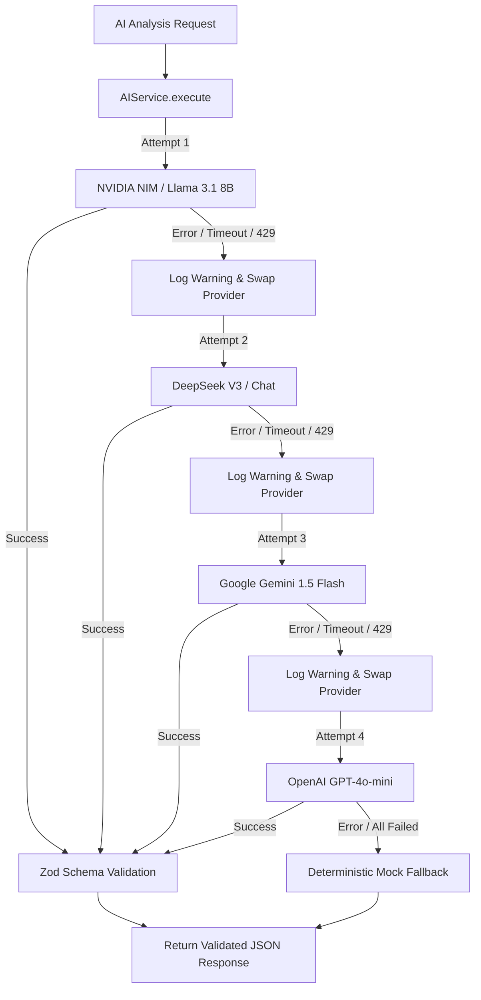

# AI Architecture & Multi-LLM System Documentation

This document describes the multi-provider AI architecture implemented in **ApplyHub**.

---

## 🤖 AI System Architecture

ApplyHub features a resilient multi-provider AI subsystem (`backend/services/ai/`). Rather than relying on a single AI model vendor, ApplyHub orchestrates requests across multiple Large Language Model (LLM) providers with automatic fallback capabilities.

---

## 🛠 Active AI Providers

| Provider Name | Adapter Class | Target Model | Libraries / SDK |
|---|---|---|---|
| **NVIDIA NIM** (Primary) | `NvidiaProvider` | `meta/llama-3.1-8b-instruct` | `openai` (targeting `integrate.api.nvidia.com`) |
| **DeepSeek** (Fallback 1) | `DeepSeekProvider` | `deepseek-chat` | `openai` (targeting `api.deepseek.com`) |
| **Google Gemini** (Fallback 2) | `GeminiProvider` | `gemini-1.5-flash` | `@google/generative-ai` |
| **OpenAI** (Fallback 3) | `OpenAIProvider` | `gpt-4o-mini` | `openai` |

---

## 📋 Structured JSON Output & Zod Validation

To ensure AI responses conform strictly to expected data structures without parsing failures, `backend/services/ai/providers/base.provider.js` defines explicit Zod schemas:

### 1. Resume Parsing Schema (`parsedDataSchema`)
Extracts candidate contact details, skills, technologies, frameworks, languages, certifications, work experience, projects, education, and soft skills.

### 2. ATS Analysis Schema (`atsAnalysisSchema`)
Generates ATS compatibility score (0-100), missing skills list, strong skills, weak skills, formatting suggestions, missing structural sections, and actionable improvement steps.

### 3. Job Matching Schema (`jobMatchingSchema`)
Generates semantic match percentage (0-100), match explanation, advantages, disadvantages, missing skills, resume improvement suggestions, interview readiness assessment, difficulty level, expected interview topics, preparation roadmap, and learning resources.

---

## ⚡ Mock Fallback Mechanism

If all configured AI keys are missing from `.env` or experiencing upstream API outages (such as quota exhaustion 429 errors), every provider class inherits deterministic mock generators from `BaseProvider`:
- `getMockParsedData()`
- `getMockATSAnalysis()`
- `getMockJobMatching()`
- `getMockCoverLetter()`
- `getMockInterviewQuestions()`
- `getMockJobEnrichment()`

This guarantees that application workflows (such as demoing the UI or testing API endpoints) never break due to third-party API issues.

---

## ❓ Interview Questions & Answers

### Q1: How does ApplyHub enforce structured JSON output from LLM providers?
**Answer**: ApplyHub uses a two-pronged strategy. First, it passes strict system instructions requiring valid JSON output matching a specific schema. For providers supporting native JSON modes (such as OpenAI and DeepSeek), `response_format: { type: "json_object" }` is passed. For Gemini, `responseMimeType: "application/json"` is specified. Second, raw AI response strings are sanitized via `cleanJSONString()` and validated against runtime Zod schemas (`parsedDataSchema.parse(rawJson)`). If Zod validation succeeds, the typed object is returned; if it fails, a clean fallback is used.
