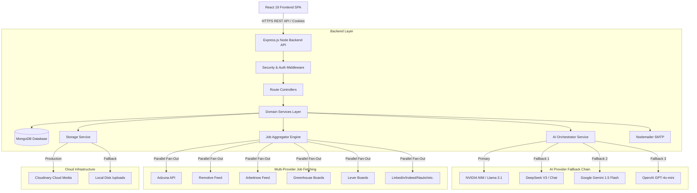

# ApplyHub Architecture Overview

This document provides a comprehensive structural overview of **ApplyHub**, an AI-powered, multi-provider job search, ATS resume analysis, and application tracking SaaS platform built on Node.js, Express, MongoDB, and React.

---

## 🏛 High-Level System Architecture

ApplyHub operates on a modern, decoupled client-server architecture. The frontend React single-page application (SPA) communicates with the backend Node.js REST API over HTTPS, utilizing JWT tokens passed via HTTP-only cookies or Authorization headers.

---

## 🔄 Core Data & Execution Flows

### 1. User Authentication & Session Management
1. **Registration / Login**: User submits credentials (email/password or phone/OTP).
2. **Password Hashing**: Passwords are hashed with `bcryptjs` (salt rounds: 10).
3. **Token Issuance**: Server generates a 25-minute Access Token and a 7-day Refresh Token using `jsonwebtoken`.
4. **Session Tracking**: A `Session` document is persisted in MongoDB storing the hashed refresh token, user agent, IP address, OS, and browser details.
5. **Cookie Delivery**: Tokens are attached to response headers as HTTP-only, SameSite, secure cookies.

### 2. Multi-Provider Job Search & Deduplication
1. **Search Request**: User executes a search query with filters (keywords, location, work mode, salary, country).
2. **Parallel Fan-out**: `JobAggregatorService` issues `Promise.allSettled()` requests across all enabled job providers (Adzuna, Remotive, Arbeitnow, Greenhouse, Lever, LinkedIn, Indeed, etc.).
3. **Deterministic Enrichment**: Raw job objects are normalized by `JobEnrichmentService` to extract skills, technologies, experience, and salary bounds using regex word-boundary scanners.
4. **Jaccard Deduplication**: Jobs are deduplicated based on canonical apply URLs, title/company/location triples, and Jaccard word-overlap similarity across job descriptions (>75% threshold).
5. **Country Filtering**: `CountryService` filters roles based on country eligibility rules and location tokens.
6. **Smart Weighted Ranking**: Results are ranked using a multi-signal formula:
   - **40%** Resume Match Score (keyword/tech overlap)
   - **20%** Country Location Priority
   - **15%** Posting Freshness
   - **10%** Salary Level
   - **10%** Search Keyword Match
   - **5%** Company Brand Quality
7. **Cache Persistence**: Filtered & ranked results are upserted into MongoDB `Job` collection and cached in memory.

### 3. AI Resume Parsing & ATS Analysis
1. **Upload**: Candidate uploads a PDF or DOCX resume.
2. **Extraction**: `ParserService` uses `pdf-parse` or `mammoth` to extract raw plain text.
3. **AI Parsing**: `AIService` sends raw text to the active AI provider chain (NVIDIA -> DeepSeek -> Gemini -> OpenAI).
4. **Zod Validation**: The AI response is parsed and validated against strict Zod schemas (`parsedDataSchema`, `atsAnalysisSchema`).
5. **Database Storage**: Parsed candidate profiles and ATS scores are saved in the `Resume` collection.

---

## 🛠 Tech Stack & Architecture Highlights

| Layer | Technology | Key Details |
|---|---|---|
| **Frontend UI** | React 19, Vite 8, TailwindCSS 4 | Modern SPA, Framer Motion animations, Recharts, Lucide icons |
| **State Management** | TanStack React Query v5, Context API | Client state & asynchronous server state caching |
| **Backend Runtime** | Node.js, Express.js 5 | REST API, async route handling, modular service layer |
| **Database** | MongoDB, Mongoose 9 | Document database, compound indexing, full-text search indexes |
| **AI Orchestration** | NVIDIA, DeepSeek, Gemini, OpenAI, Zod | Multi-provider fallback chain with structured JSON validation |
| **Document Parsing** | pdf-parse, mammoth | Extracting text from PDF and Word documents |
| **Security** | Helmet, CORS, Rate-Limiter, bcryptjs, JWT | HTTP-only cookies, password hashing, payload limits |
| **Caching & Cron** | In-memory NodeCache, node-cron | 45-min background job cache refresh & stale listing pruning |

---

## 🎯 Design Patterns Used

1. **Repository / Service Layer Pattern**: Business logic is decoupled from Express controllers into isolated services (`auth.service.js`, `jobAggregator.service.js`, `matching.service.js`).
2. **Provider / Strategy Pattern**: Job boards (`BaseJobProvider`) and AI models (`BaseProvider`) implement abstract base classes with standardized interfaces, allowing new providers to be added seamlessly.
3. **Fallback Chain Pattern**: AI requests automatically try primary provider (NVIDIA), falling back to DeepSeek, Gemini, OpenAI, or local mocks if API quotas fail.
4. **Middleware Pipeline Pattern**: Express request pipeline executes Rate Limiting -> Helmet -> CORS -> Cookie Parsing -> JWT Auth -> Validation -> Controller -> Central Error Handler.

---

## ❓ Interview Questions & Answers

### Q1: How does ApplyHub handle job deduplication across multiple job boards?
**Answer**: ApplyHub uses a multi-layered deduplication algorithm inside `JobAggregatorService`. First, it normalizes and checks canonical apply URLs. Second, it compares normalized `(title + company + location)` triples. Third, it calculates Jaccard word-set similarity over the first 100 words of job descriptions. If description overlap exceeds 75%, jobs are flagged as duplicates, and the newest posting is retained.

### Q2: How does the AI provider fallback mechanism work?
**Answer**: ApplyHub's `AIService` implements a resilient fallback chain (`NVIDIA` -> `DeepSeek` -> `Gemini` -> `OpenAI`). When an AI request (such as ATS parsing or resume matching) is issued, `execute()` attempts the primary provider. If an HTTP error, rate limit (429), or timeout occurs, it logs a warning and seamlessly swaps to the next provider in line. If all configured providers fail, a clean deterministic mock fallback is returned so user flows are never blocked.
