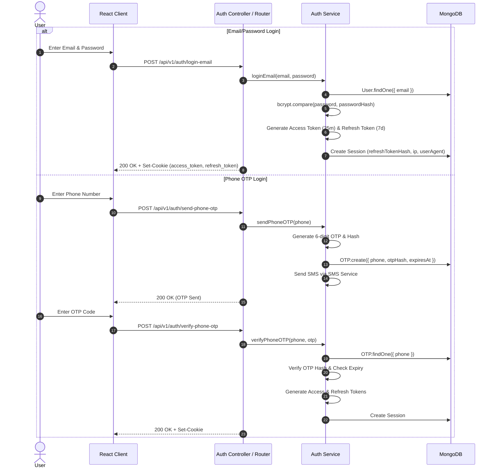

# Authentication System Documentation

This document explains the multi-channel, session-tracked authentication architecture implemented in **ApplyHub**.

---

## 🔐 Overview

ApplyHub supports dual authentication channels:
1. **Email & Password Authentication** (with bcrypt password hashing & email verification links).
2. **Phone & OTP Authentication** (with 6-digit OTP codes, 10-minute expiry, and attempt rate-limiting).

Tokens are issued as a dual-token JWT pair (Short-lived Access Token + Long-lived Refresh Token) stored securely in HTTP-only cookies and tracked in a MongoDB `Session` collection.

---

## 🔄 Authentication Execution Flow



---

## 🛠 Step-by-Step Implementation Details

### 1. Password Hashing (`bcryptjs`)
Passwords are never stored in plain text. `auth.service.js` uses `bcryptjs` to hash passwords before database persistence:
```javascript
const salt = await bcrypt.genSalt(10);
const passwordHash = await bcrypt.hash(password, salt);
```
During login, `bcrypt.compare(password, user.passwordHash)` validates credentials.

### 2. Dual-Token JWT Strategy (`token.service.js`)
- **Access Token**: Short expiration (`25m`), signed with `JWT_ACCESS_SECRET`. Contains lightweight user identification:
  ```json
  { "userId": "60d5ecb8b3b3a214c8e3b1a1", "role": "user", "sessionId": "60d5ecb8b3b3a214c8e3b1a9" }
  ```
- **Refresh Token**: Long expiration (`7d`), signed with `JWT_REFRESH_SECRET`. Stored as a cryptographic SHA-256 hash inside the database `Session` document.

### 3. Session & Device Tracking (`Session.js`)
When a user logs in, a `Session` record is created storing:
- `userId`: Reference to the `User` model.
- `refreshTokenHash`: SHA-256 hash of the issued refresh token.
- `ipAddress`: Request IP address.
- `userAgent`: Parsed user agent (`deviceType`, `browser`, `os`).
- `lastActiveAt`: Timestamp updated on token refresh.

Users can view and revoke active device sessions from their **Profile Page** (`/profile`).

---

## 🔒 Security Best Practices Implemented

- **HTTP-Only Cookies**: Prevents client-side JavaScript access (`XSS` mitigation).
- **SameSite Protection**: Configured with `SameSite=Lax` or `SameSite=None` (in HTTPS production) to mitigate Cross-Site Request Forgery (`CSRF`).
- **OTP Expiry & Attempt Limits**: OTPs expire after 10 minutes and lock out after 5 consecutive failed attempts.
- **Session Invalidation on Logout**: Logout revokes the specific session document in MongoDB and clears cookies.

---

## ❓ Interview Questions & Answers

### Q1: Why store the Refresh Token hash in the database instead of the raw refresh token?
**Answer**: Storing raw refresh tokens in a database poses a severe security risk if a database dump or read vulnerability occurs. An attacker with access to raw refresh tokens could impersonate users until token expiry. By storing a cryptographic hash (`crypto.createHash('sha256').update(refreshToken).digest('hex')`), the database only stores non-reversible hashes. During refresh, the incoming token is hashed and compared against the stored hash.

### Q2: How does ApplyHub handle silent token refresh?
**Answer**: When the frontend Axios interceptor receives a 401 error due to an expired access token, it calls `POST /auth/refresh-token`. The server reads the `refresh_token` cookie, verifies its signature, hashes it, and checks if an active `Session` document exists in MongoDB. If valid, a new access token is returned and the session's `lastActiveAt` timestamp is updated.
