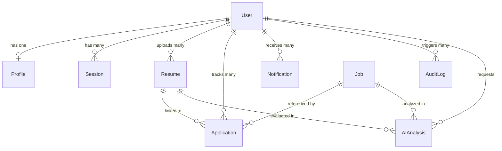

# Database Architecture & Schemas

This document provides complete documentation for the **MongoDB Database Architecture** used in **ApplyHub**.

---

## 🗄 Overview

ApplyHub uses **MongoDB** as its primary NoSQL document database, object-modeled using **Mongoose 9**. 

### Connection Setup (`backend/config/db.js`)
The database connection is established at server boot in `server.js` using Mongoose:

```javascript
const connectDB = async () => {
  try {
    const conn = await mongoose.connect(process.env.MONGODB_URI, {
      autoIndex: true,
    });
    logger.info(`MongoDB Connected: ${conn.connection.host}`);
  } catch (error) {
    logger.error(`Database connection failed: ${error.message}`);
    process.exit(1);
  }
};
```

---

## 📊 Entity Relationship Diagram (ERD)



---

## 📑 Collections & Schemas Overview

ApplyHub defines 10 Mongoose models in `backend/models/`:

| Collection | Model File | Purpose | Primary Indexes |
|---|---|---|---|
| `users` | `User.js` | User accounts, credentials, and roles. | `email` (unique), `phone` (sparse) |
| `profiles` | `Profile.js` | User job preferences (roles, salary, location). | `userId` (unique) |
| `resumes` | `Resume.js` | Uploaded resume files, parsed text, and ATS scores. | `userId`, `isActive` |
| `jobs` | `Job.js` | Aggregated job listings from external providers. | `(source, externalId)` (unique), text index on `(title, company, description, skills)` |
| `applications` | `Application.js` | User application pipeline tracking states. | `(userId, jobId)` (unique), `status` |
| `aianalyses` | `AIAnalysis.js` | Cached AI semantic match reports per user/job. | `(userId, resumeId, jobId)` (unique) |
| `sessions` | `Session.js` | Active device user sessions and refresh token hashes. | `refreshTokenHash`, `expiresAt` (TTL) |
| `otps` | `OTP.js` | 6-digit phone & reset verification codes. | `expiresAt` (TTL) |
| `notifications` | `Notification.js` | User in-app notifications and alerts. | `userId`, `read` |
| `auditlogs` | `AuditLog.js` | User security event audit trail. | `userId`, `createdAt` |

---

## 🔍 Database Optimization & Indexing Strategies

### 1. Unique & Compound Indexes
- **Job Deduplication**: `JobSchema.index({ source: 1, externalId: 1 }, { unique: true })` ensures a job listing from a specific provider is never duplicated.
- **Application Tracking**: `ApplicationSchema.index({ userId: 1, jobId: 1 }, { unique: true })` prevents a user from creating multiple duplicate tracker items for the same job.

### 2. Full-Text Search Indexes
To support instant keyword search across cached listings in MongoDB, `Job.js` defines a text index:
```javascript
JobSchema.index({
  title: "text",
  company: "text",
  description: "text",
  skills: "text",
});
```

### 3. TTL (Time-To-Live) Automatic Expiry Indexes
- **OTP Auto-Deletion**: `OTPSchema.index({ expiresAt: 1 }, { expireAfterSeconds: 0 })` automatically deletes expired OTPs from the database.
- **Session Expiry**: `SessionSchema.index({ expiresAt: 1 }, { expireAfterSeconds: 0 })` automatically cleans up expired user sessions.

---

## ❓ Interview Questions & Answers

### Q1: Why use a NoSQL database like MongoDB for ApplyHub instead of a relational SQL database?
**Answer**: Job listings aggregated from 15+ external sources (Adzuna, Greenhouse, Lever, Remotive) have highly dynamic, semi-structured schemas (varying fields for salary, skills, internship details, and AI metadata). MongoDB's flexible JSON/BSON document model allows seamless storage and evolution of job objects and parsed resume trees without requiring complex relational schema migrations.

### Q2: How does ApplyHub handle MongoDB text indexing for keyword searches?
**Answer**: ApplyHub creates a compound text index on `Job.js` covering `title`, `company`, `description`, and `skills`. When `JobController.getJobs()` receives a query string, MongoDB evaluates `$text: { $search: query }` utilizing pre-computed inverted index weights, allowing sub-10ms full-text searches over thousands of cached listings.
