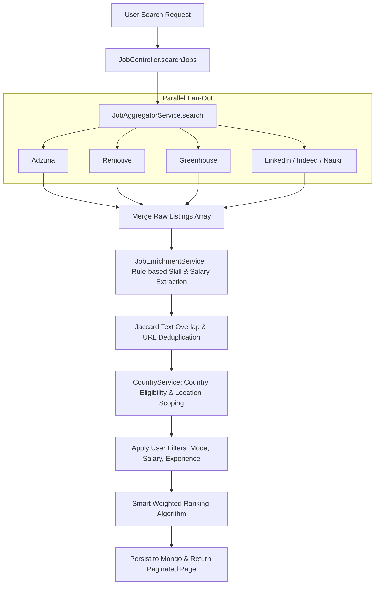

# Job Discovery & Aggregation Engine Documentation

This document explains the job aggregation, deduplication, enrichment, and ranking pipeline implemented in **ApplyHub**.

---

## 💼 Overview

The ApplyHub Job Engine (`backend/services/jobAggregator.service.js`) replaces static job listings with a production-grade, multi-provider job search system. It aggregates public postings in real time across 15+ providers, normalizes job data, eliminates duplicates, applies country eligibility rules, and ranks listings using a smart weighted scoring algorithm.

---

## 🔌 Supported Job Providers (`services/providers/`)

Every provider extends `BaseJobProvider` and implements a standardized `searchJobs(query, filters)` method:

```
Registered Job Scrapers:
├── AdzunaProvider           (Adzuna REST API - country-scoped searches)
├── RemotiveProvider         (Remotive public remote feed)
├── ArbeitnowProvider        (Arbeitnow European job feed)
├── GreenhouseProvider       (Greenhouse company board scrapers)
├── LeverProvider            (Lever startup board scrapers)
├── SmartRecruitersProvider  (SmartRecruiters public board scrapers)
├── AshbyProvider            (Ashby public board scrapers)
├── RecruiteeProvider        (Recruitee public board scrapers)
├── LinkedInProvider         (Public LinkedIn listings adapter)
├── IndeedProvider           (Public Indeed job listings adapter)
├── NaukriProvider           (Public Naukri job adapter)
├── FounditProvider          (Public Foundit job adapter)
├── CutshortProvider         (Public Cutshort startup job adapter)
├── InstahyreProvider        (Public Instahyre job adapter)
├── WellfoundProvider        (Public Wellfound startup adapter)
└── YCJobsProvider           (Public Y Combinator startup job adapter)
```

---

## 🔄 Aggregation & Search Pipeline



---

## 🎯 Smart Weighted Ranking Algorithm

Jobs are sorted by relevance using a multi-signal weighted scoring formula:

1. **40% Resume Match**: Fast local Jaccard technology/skill overlap between candidate's active resume and the job listing.
2. **20% Country Location Priority**:
   - **Tier 0** (20 pts): Local onsite/hybrid position matching user's target country.
   - **Tier 1** (15 pts): Local remote position matching target country.
   - **Tier 2** (10 pts): Global remote open to target country candidates.
   - **Tier 3** (0 pts): Other open positions.
3. **15% Freshness Bonus**:
   - $\le 1$ day: 15 pts
   - $\le 3$ days: 12 pts
   - $\le 7$ days: 9 pts
   - $\le 14$ days: 5 pts
   - $\le 30$ days: 2 pts
4. **10% Salary Score**: Higher scores for jobs specifying compensation bounds.
5. **10% Skill Match**: Keyword matches in job title, description, and tags.
6. **5% Company Quality**: Boosts top brand names (Google, Stripe, Zomato, Razorpay) or listings with company logos.

---

## 🧹 Jaccard Duplicate Removal Engine

To eliminate duplicate cross-postings across job boards, `JobAggregatorService.deduplicate()` checks:
1. **Apply URL Match**: Canonicalized URL comparison ignoring query parameters.
2. **Triple Match**: Identical `(Title + Company + Location)` strings.
3. **Description Jaccard Similarity**: Calculates word-set intersection over union on description text. Overlaps $> 75\%$ flag a duplicate, keeping the newest posting date.

---

## ❓ Interview Questions & Answers

### Q1: Why combine rule-based enrichment (`JobEnrichmentService`) with LLM AI summary generation?
**Answer**: Performance and cost efficiency. Running LLM calls for hundreds of raw aggregated search results on every query would introduce 5-10 second latencies and high API costs. ApplyHub uses `JobEnrichmentService` for instant deterministic regex scanning (skills, technologies, experience, salary bounds) during the initial fetch. Heavy LLM passes (summary, interview roadmaps, cover letters) run lazily only for the 12 listings displayed on the user's current page.
