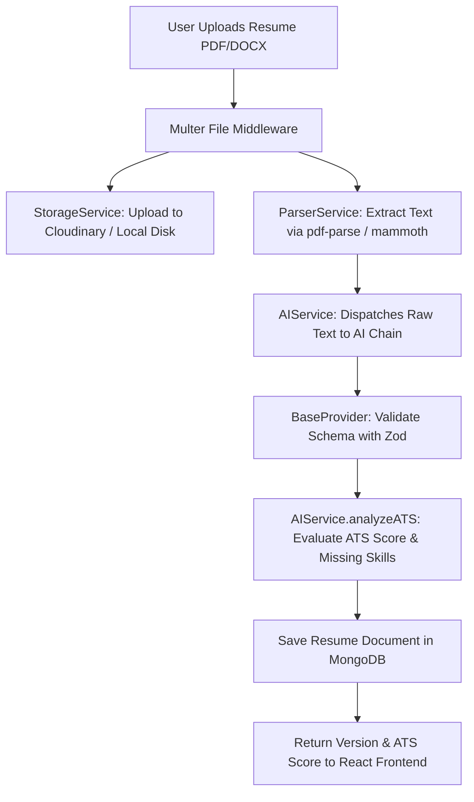

# Resume Parsing & ATS Analysis System Documentation

This document explains the resume parsing, version management, and ATS optimization pipeline implemented in **ApplyHub**.

---

## 📑 Overview

ApplyHub provides an intelligent resume management platform (`backend/controllers/resume.controller.js`). Candidates can upload PDF or Word resumes. The backend extracts plain text, invokes the AI provider chain for structured parsing and ATS scoring, stores resume versions in MongoDB, and matches candidate profiles against live job postings.

---

## 🔄 Resume Processing Pipeline

---

## 🛠 Step-by-Step Technical Implementation

### 1. File Upload Handling (`Multer`)
`backend/middleware/validation.js` configures `multer` memory/disk storage:
- **Allowed Formats**: `.pdf`, `.docx`, `.doc`
- **File Size Limit**: 5 MB (`5 * 1024 * 1024` bytes)
- **Validation**: Rejects invalid MIME types before processing.

### 2. Document Text Extraction (`ParserService.js`)
- **PDF Files**: Extracted using `pdf-parse`.
- **Word Files**: Extracted using `mammoth.extractRawText()`.

### 3. Structured AI Parsing (`parsedDataSchema`)
Raw extracted text is sent to `aiService.parseResume(rawText)`. The AI extracts structured JSON containing:
- Contact details (name, email, phone)
- Technical skills & frameworks
- Spoken languages & certifications
- Work experience array (company, role, start/end dates, bullet descriptions)
- Project array (title, description, technologies used)
- Education history (institution, degree, graduation year)

### 4. ATS Scoring & Analysis (`atsAnalysisSchema`)
The candidate profile is evaluated to generate an ATS Analysis object:
- `atsScore`: Overall score from 0 to 100.
- `strongSkills`: Highlighted matching skills.
- `missingSkills`: High-value missing keywords.
- `formattingSuggestions`: Actionable layout improvements.
- `improvementSuggestions`: Bullet-point recommendations to increase recruiter callback rates.

### 5. Resume Versioning & Active Selection
- Each upload increments the user's `version` counter (V1, V2, V3).
- Setting a resume version as active updates `isActive: true` on that document and sets `isActive: false` on all other user resumes.
- All subsequent job searches and recommendations score jobs against the active resume version.

---

## ❓ Interview Questions & Answers

### Q1: How does ApplyHub maintain historic resume versions while calculating real-time recommendations?
**Answer**: Each uploaded resume is stored as a separate document in the `Resume` collection with a unique `_id` and sequential `version` number. One document per user has `isActive: true`. When `JobController.getRecommended()` or `JobController.searchJobs()` executes, it queries `Resume.findOne({ userId, isActive: true })` to retrieve the user's active resume. This allows candidates to keep historic resumes while instantly testing how different versions affect job match scores.
